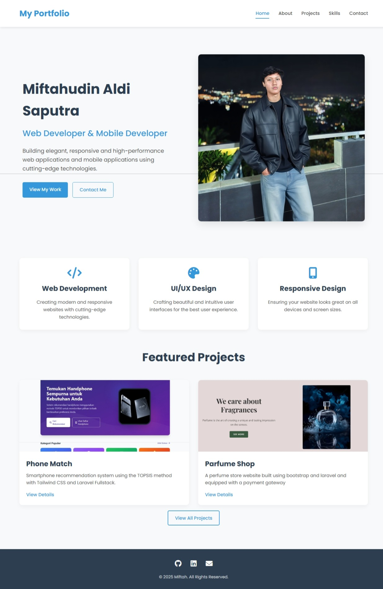

# My Professional Portfolio




A modern, responsive portfolio website built with Vue.js to showcase my projects and skills as a web developer.

## 🌟 Live Demo

Visit the live portfolio: [https://your-portfolio-url.vercel.app](https://your-portfolio-url.vercel.app)

## ✨ Features

- 📱 Fully responsive design for all devices
- 🎨 Modern UI with smooth animations
- 🚀 Fast performance with Vue.js
- 📂 Showcase of projects with filtering capabilities
- 📝 Contact form for potential clients or employers
- 📊 Skills visualization with progress bars
- 🔍 SEO optimized

## 🛠️ Technologies Used

- **Frontend Framework**: Vue.js 3
- **Router**: Vue Router
- **Styling**: CSS3 with Flexbox & Grid
- **Icons**: Font Awesome
- **Deployment**: Vercel
- **Version Control**: Git & GitHub

## 📋 Pages

- **Home**: Introduction and featured projects
- **About**: Personal information and professional background
- **Projects**: Portfolio of work with category filtering
- **Skills**: Technical and soft skills with visual representation
- **Contact**: Contact form and other ways to reach me

## 💻 Local Development

### Prerequisites

- Node.js (v14 or higher)
- npm or yarn

### Installation

1. Clone the repository
   ```bash
   git clone https://github.com/Mifta24/my-portfolio.git
   cd my-portfolio
   ```

2. Install dependencies
   ```bash
   npm install
   # or
   yarn install
   ```

3. Start development server
   ```bash
   npm run serve
   # or
   yarn serve
   ```

4. Open [http://localhost:8080](http://localhost:8080) in your browser

### Building for Production

```bash
npm run build
# or
yarn build
```

## 🚀 Deployment

This portfolio is set up for easy deployment on Vercel:

1. Fork or clone this repository
2. Import the project to Vercel
3. Configure build settings if necessary
4. Deploy!

## 📝 License

This project is open source and available under the [MIT License](LICENSE).

## 📞 Contact

Feel free to reach out if you have any questions or just want to connect:

- **Email**: miftafree3@gmail.com
- **GitHub**: [@Mifta24](https://github.com/Mifta24)
- **LinkedIn**: [Your LinkedIn]()

---

⭐️ From [Miftahudin Aldi Saputra](https://github.com/Mifta24)
